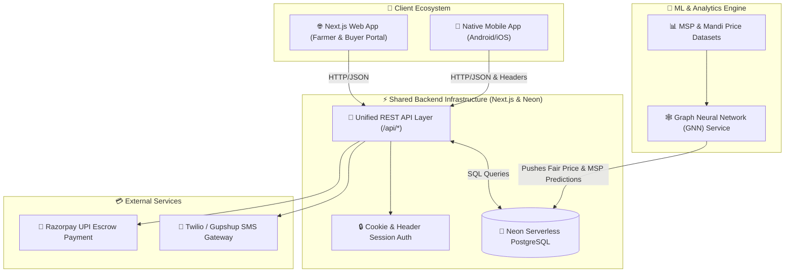

# 🌾 E-Krishi | ಇ-ಕೃಷಿ
### Next-Gen Agricultural Marketplace & Fair Pricing Platform for Karnataka

[](https://nextjs.org/)
[](https://www.typescriptlang.org/)
[](https://neon.tech/)
[](https://tailwindcss.com/)
[](https://razorpay.com/)
[](LICENSE)

---

## 📌 Overview

**E-Krishi (ಇ-ಕೃಷಿ)** is a direct **Farm-to-Buyer Agricultural Marketplace** engineered to eliminate predatory middlemen, guarantee Minimum Support Prices (MSP), and empower Karnataka's farmers with real-time AI-driven fair price estimates. 

By unifying web, cross-platform mobile apps, and Graph Neural Network (GNN) machine learning services onto a single serverless backend infrastructure, E-Krishi delivers seamless trading, transparent bidding, and instant UPI escrow payments.

---

## 🏗️ System Architecture

The ecosystem relies on a unified, high-performance API backend built on Next.js App Router and Neon Serverless PostgreSQL. It serves web clients, native mobile applications, and AI prediction services concurrently.



---

## 🤝 Cross-Platform Integration & Shared Backend Architecture

Our team built E-Krishi around a **unified micro-service API architecture**, allowing multiple team members to build client applications independently on top of the same backend database and endpoints.

### 📱 1. Mobile App Integration (React Native / Flutter / Android)
The native mobile app built for on-field farmers uses the exact same API routes exposed by this project:
- **Authentication**: Uses `x-user-phone` header or `ekrishi_session` token via `/api/auth/login` and `/api/auth/me`.
- **Listings & Bids**: Fetches real-time market data via `/api/listings` and `/api/bids`.
- **Offline SMS Bridge**: Supports low-connectivity areas by parsing SMS bid codes (`sms_listing_ref`) through `/api/sms/webhook`.

### 🧠 2. Graph Neural Network (GNN) Fair Price Prediction Engine
To protect farmers from selling produce below fair market value, our ML team trained a **Spatial-Temporal Graph Neural Network (GNN)** using PyTorch Geometric:
- **Graph Nodes**: Karnataka Districts, APMC Mandis, and Inter-state logistics routes.
- **Node Features**: Weather trends, historical crop arrival volumes, transport fuel prices, and state MSP guidelines.
- **Graph Edges**: Highway networks, supply chain transportation cost vectors, and inter-mandi trade volume.
- **Backend Ingestion**: The GNN inference pipeline periodically updates the `fair_price_estimate` and `msp_at_listing` fields in the shared Neon PostgreSQL database.
- **Real-Time Badge Display**: When farmers create a listing or buyers place a bid, the backend compares prices against the GNN recommendation to display **Great Price!** or **Below MSP Warning** badges automatically.

---

## 🌟 Key Features

- 🌾 **Farmer Dashboard**: Track active produce listings, incoming buyer bids, estimated revenue, and transaction history.
- 🛒 **Buyer Marketplace**: Search and filter harvests by district, crop, quality grade (`Grade A/B/C`), and price range.
- 💰 **Real-Time Bidding & Direct Buy**: Buyers can submit competitive bids or instantly purchase harvests via **Buy Now**.
- 🛡️ **Escrow Payment Security**: Integrated with **Razorpay UPI** and instant QR scanning for transparent payment releases upon delivery.
- 🧾 **Automatic GST & Tax Invoicing**: Calculates CGST, SGST, IGST, and platform fees automatically while generating compliant PDF invoices.
- 🌐 **Full Multilingual Support**: Built-in instant toggle between **English** and **Kannada (ಕನ್ನಡ)**.

---

## 🛠️ Tech Stack

- **Framework**: [Next.js 15 (App Router)](https://nextjs.org/)
- **Language**: [TypeScript](https://www.typescriptlang.org/)
- **Database**: [Neon PostgreSQL Serverless](https://neon.tech/) (`pg` connection pool)
- **Styling**: [Tailwind CSS](https://tailwindcss.com/) with Glassmorphism & Custom Design Tokens
- **State Management**: [Zustand](https://zustand-demo.pmnd.rs/) & [React Query](https://tanstack.com/query)
- **Payments**: Razorpay Node SDK & UPI Deep Links
- **Machine Learning**: PyTorch Geometric (GNN Price Prediction Engine)

---

## 🚀 Getting Started

### 1. Prerequisites
- Node.js `v18.x` or higher
- npm / yarn / pnpm

### 2. Installation
```bash
# Clone the repository
git clone https://github.com/Gaman-123/farmer.git
cd farmer/ekrishi-portal

# Install dependencies
npm install
```

### 3. Environment Setup
Create a `.env.local` file in the root directory:
```env
DATABASE_URL=postgresql://neondb_owner:<PASSWORD>@<HOST>/neondb?sslmode=require
RAZORPAY_KEY_ID=rzp_test_xxxxxxxxx
RAZORPAY_KEY_SECRET=xxxxxxxxxxxxxxxxx
```

### 4. Database Setup & Seeding
```bash
# Run mock data seeding script
node run_seed.js
```

### 5. Run Development Server
```bash
npm run dev
```
Open `http://localhost:3000` in your browser.

---

## 🔗 Key API Endpoints

| Endpoint | Method | Description |
|---|---|---|
| `/api/auth/login` | `POST` | Authenticate user & switch active persona (Farmer / Buyer) |
| `/api/listings` | `GET / POST` | Fetch active marketplace listings / Create new crop listing |
| `/api/bids` | `GET / POST` | Retrieve incoming bids / Submit buyer bid |
| `/api/bids/[bid_id]/[action]` | `POST` | Accept, reject, or counter-offer a pending bid |
| `/api/transactions` | `GET / POST` | Generate escrow transaction & GST tax invoice |
| `/api/payments/create-order` | `POST` | Create Razorpay UPI payment order |

---

## 📜 License

Distributed under the MIT License. See `LICENSE` for more information.

---
*Built with ❤️ for the farmers of Karnataka.* 🌾
